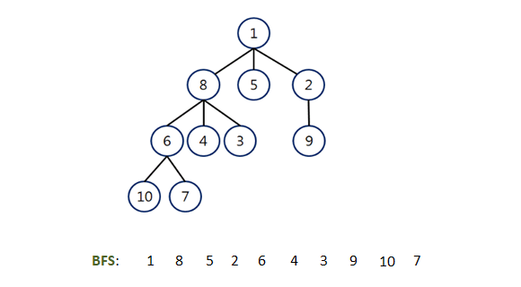

# Table of content:
 - Introduction
 - Analysis

### Introduction

BFS stands for breadth-first search. It starts from the root of the given graph and then traverse all nodes at the current depth level before moving on to nodes at the next depth level.

#### Analysis
The time complexity of BFS depends upon the data structure used to store the graph.

If, for example, an adjacency list is used to store the graph.

In adjacency, the list node keeps track of all of its neighboring edges. Let's say that there are V nodes and E edges in the graph.

We can find all the neighbors of a node just by traversing its adjacency list only once, that too in linear time.

The sum of the sizes of the adjacency lists of all nodes in a directed graph is E. Thus, for a directed graph, the time complexity is O(V) + O(E) = O(V + E).

In an undirected graph, each edge appears twice. Once at either end of the adjacency list for the edge. Thus, in this case, the time complexity is O(V) + O (2E) ~ O(V + E).

If we use an adjacency matrix to store the graph, then.

To find all the neighboring nodes, we have to traverse a full row of length V in the matrix.

Each row in an adjacency matrix corresponds to a node in the graph, and each row stores information about the edges that emerge from that node. As a result, in this situation, the time complexity of BFS is O(V * V) = O(V ^ 2).

Because we're using a queue (FIFO architecture) to keep track of the visited nodes, the queue would take the size of the graph's nodes (or vertices). As a result, the space complexity is O (V).