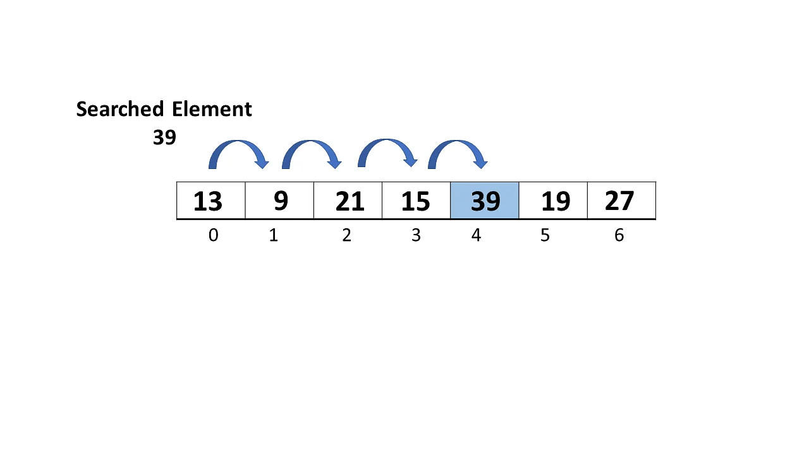

# Table of Contents

- [Introduction](#introduction)
- [How the algorithm works](#how-the-algorithm-works)
- [Python implementation](#python-implementation)
- [Analysis](#analysis)

## Introduction
Linear search is an algoritem we can use to search for an element through an array.

## How the algorithm works
At each step, it compares the element at the index to the elememt we want to find. Once we found the element or we went through the entire array without finding the element - the algoritm finishes.

<small>_Photo curtesy of: [Simplilearn](https://www.simplilearn.com/tutorials/data-structure-tutorial/linear-search-algorithm)_</small>

## Python implementation
[You can see my python implementation in here](./linear_search.py)
## Analysis

- Best case: We found the array at the first try - `O(1)`
- Worst case: We traversed through the entire array and couldnt find the element. in an array of 8 elemets it will be:
  8 -> 7 -> 6 -> 5 -> 4 -> 3 -> 2 -> 1 => **8**

8 iteration for a 8 size array results in a linear time complexity - `O(n)`