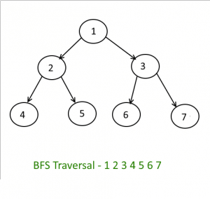

# Table of Contents

- [Introduction](#introduction)
- [How the algorithm works](#how-the-algorithm-works)
- [Python implementation](#python-implementation)
- [Analysis](#analysis)

### Introduction
A breadth-first search is when you inspect every node on a level starting at the top of the tree and then move to the next level. 

Storing the front nodes in a queue creates the level-by-level pattern of a breadth-first search. Child nodes are searched in the order they are added to the front. The nodes on the next level are always behind the nodes on the current level. Breadth-first search is known as a complete algorithm since no matter how deep the goal is in the tree it will always be located.

### How the algorithm works
BFS selects a single node (initial or source point) in a graph and then visits all the nodes adjacent to the selected node. BFS accesses these nodes one by one.

The visited and marked data is placed in a queue by BFS. A queue works on a first in first out basis. Hence, the element placed in the graph first is deleted first.

<small>_Photo curtesy of: [Tutorial horizon](https://algorithms.tutorialhorizon.com/breadth-first-searchtraversal-in-a-binary-tree/)_</small>

### Python implementation
[You can see my python implementation in here](./tree_bfs.py)
### Analysis

- Best Case: Breadth-First Search has a time complexity of `O(1)` if the first node was the target. 

- Worst Case: Breadth-First Search has a time complexity of `O(n)` where n is the number of nodes in the tree. In the worst case, we will examine every node of a tree.