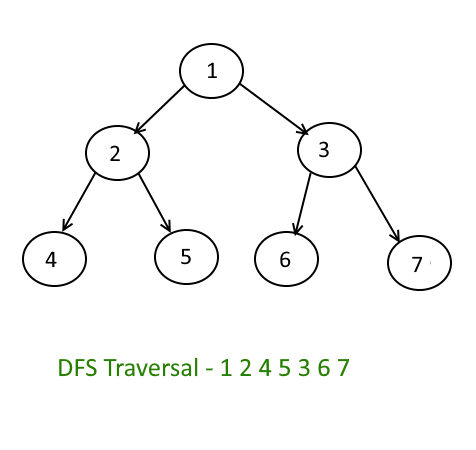

# Table of content
[TOC]

### Introduction 
A depth-first search is where you search deep into a branch and don’t move to the next one until you’ve reached the end.

Frontier nodes stored in a stack create the deep dive of a depth-first search. Nodes added to the frontier early on can expect to remain in the stack while their sibling’s children (and their children, and so on) are searched. Depth-first search is not considered a complete algorithm since searching an infinite branch in a tree can go on forever. In this situation, an entire section of the tree would be left un-inspected.

<small>_Photo curtesy of: [Tutorial horizon](https://algorithms.tutorialhorizon.com/depth-first-searchtraversal-in-binary-tree/)_</small>

### Python implementation
[You can see my python implementation in here](./tree_dfs.py)
### Analysis

Depth-First Search has a time complexity of O(n) where n is the number of nodes in the tree. In the worst case, we will examine every node of a tree.