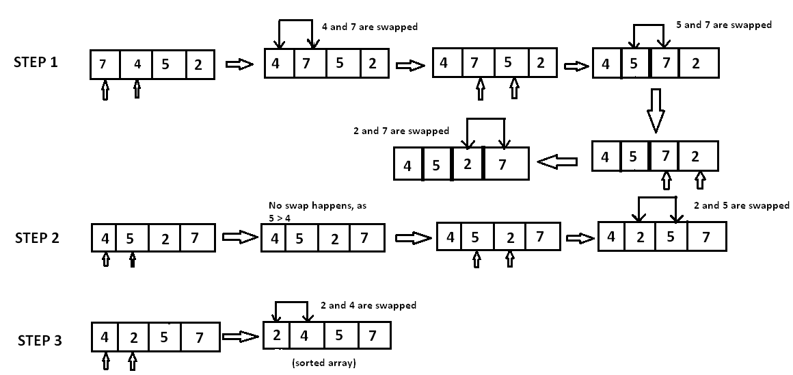

# Table of Contents

- [Introduction](#introduction)
- [How the algorithm works](#how-the-algorithm-works)
- [Python implementation](#python-implementation)
- [Analysis](#analysis)

### Introduction
Bubble sort is an introductory sorting algorithm that iterates through a list and compares pairings of adjacent elements.

According to the sorting criteria, the algorithm swaps elements to shift elements towards the beginning or end of the list.

### How the algorithm works
We implement the algorithm with two loops.

The first loop iterates as long as the list is unsorted and we assume it’s unsorted to start.

Within this loop, another iteration moves through the list. For each pairing, the algorithm asks:

In comparison, is the first element larger than the second element?

If it is, we swap the position of the elements. The larger element is now at a greater index than the smaller element.

When a swap is made, we know the list is still unsorted. The outer loop will run again when the inner loop concludes.

The process repeats until the largest element makes its way to the last index of the list. The outer loop runs until no swaps are made within the inner loop.

<small>_Photo curtesy of: [Hackerearth](https://www.hackerearth.com/practice/algorithms/sorting/merge-sort/tutorial/)_</small>

### Python implementation
[You can see my python implementation in here](./bubble_sort.py)
### Analysis

We are performing n-1 comparisons for our inner loop. Then, we must go through the list n times in order to ensure that each item in our list has been placed in its proper order.

The `n` signifies the number of elements in the list. In a worst case scenario, the inner loop does `n-1` comparisons for each n element in the list.

Therefore we calculate the algorithm’s efficiency as `O(n^2)` in average/worst case.

However, in best case, the algorithm goes through the list once and doesnt swap anything - which will result in a case on `O(n)` in best case.