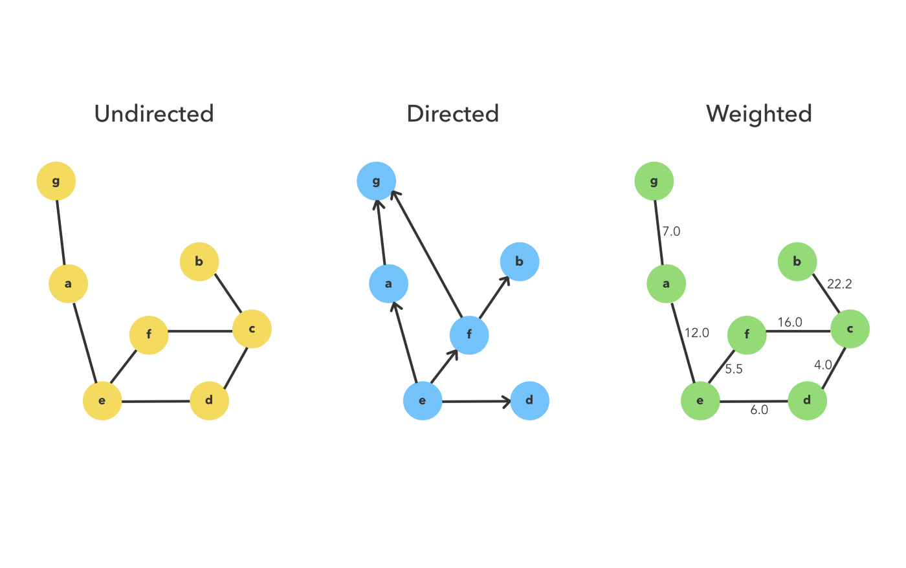

# Table of content:
 - Introduction
 - Connections
 - Weights
 - Adjacency Matrix
 - Analysis (Adjacency Matrix) 
 - Adjacency List
 - Analysis (Adjacency List) 

## Introduction

Graphs are the perfect data structure for modeling networks, which make them an indispensable piece of your data structure toolkit. They’re composed of nodes, or vertices, which hold data, and edges, which are a connection between two vertices. A single node is a vertex.

Some examples for a use of a graph can be a map of the area where you live. As a graph, we could model bus stops as vertices, with bus routes between stops functioning as the edges.

What about the internet? Web pages can be vertices, and the hyperlinks which connect them are edges.

Real-world relationships modeled as graphs are numerous, making them an essential concept to master.

### Connections 

Graphs have varying degrees of connection. The higher the ratio of edges to vertices, the more connected the graph.

consider a graph that represents a social network; people are vertices and edges are friendships. `Ted` is adjacent to `Patty`, `Ron`, and `Alice` because an edge directly connects them.

We use a single line for an edge, but these friendships are bi-directional. `Patty` is friends with `Ron` and `Ron` is friends with `Patty`.

#### Weights

For another example, we're building a graph of favorite neighborhood destinations (vertices) and routes (edges), but not all edges are equal. It takes longer to travel between Gym and Museum than it does to travel between Museum and Bakery as an example.

This is a weighted graph, where edges have a number or cost associated with traveling between the vertices. When tallying the cost of a path, we add up the total cost of the edges used.

These costs are essential to algorithms that find the shortest distance between two vertices.

We typically represent the vertex-edge relationship of a graph in two ways: an adjacency list or an adjacency matrix.

#### Adjacency Matrix

An adjacency matrix is a table. Across the top, every vertex in the graph appears as a column. Down the side, every vertex appears again as a row. Edges can be bi-directional, so each vertex is listed twice.

To find an edge between B and P, we would look for the B row and then trace across to the P column. The contents of this cell represent a possible edge.

Our diagram uses 1 to mark an edge, 0 for the absence of an edge. In a weighted graph, the cell contains the cost of that edge.

##### Analysis 

Assuming the graph has `n` vertices, the time complexity to build such a matrix is `O(n^2)`. The space complexity is also `O(n^2)`. Given a graph, to build the adjacency matrix, we need to create a square `n` times `n` matrix and fill its values with 0 and 1. It costs us `O(n^2)` space.

To fill every value of the matrix we need to check if there is an edge between every pair of vertices. That is why the time complexity of building the matrix is `O(n^2)`.

`Advantages:` 
1. Good for graph with many edges. 
2. Adjacency matrix allow us to find out if an edge is present in constant time.

`Disadvantages:` 
1. It takes a lot of space, since also the non-existing edges are represented by 0. 
2. If we want to find out which vertices are adjacent to a given vertex, you would have to go over all of the row.

#### Adjacency list

In an adjacency list, each vertex contains a list of the vertices where an edge exists. To find an edge, one looks through the list for the desired vertex.

##### Analysis 

If `m` is the number of edges in a graph, then the time complexity of building such a list is `O(m)`. The space complexity is `O(n + m)`. But, in the worst case of a complete graph, which contains `n/2` edges, the time and space complexities reduce to `O(n^2)`.

`Advantages:` 
1. We can get to each vertex's adjacency list in constant time 
2. does not take a lot of space.