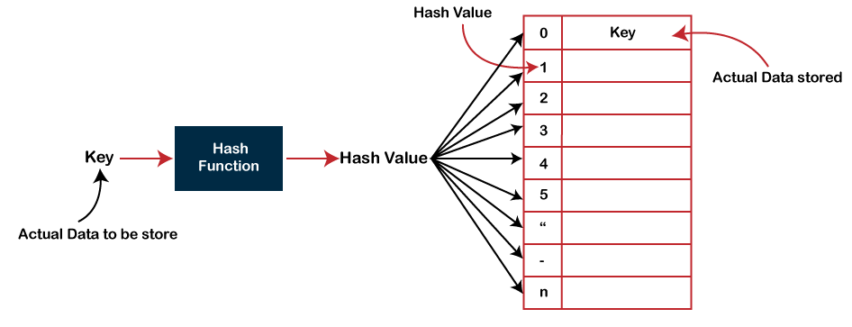

# Table of content:

- Introduction
- Methodology
- How the algorithm works
- Collisions
- Analysis

## Introduction

Being a map means relating two pieces of information, but a map also has one further requirement.

When talking about a map we describe the inputs as the keys to the map. The output is said to be the value at a given key.

In order for a relationship to be a map, every key that is used can only be the key to a single value. There doesn’t need to be a value for every possible key, there just can’t be more than one value for a given key.

### Methodology

In the case of a map between two things, we don’t really care about the exact sequence of the data. We only care that a given input, when fed into the map, gives the accurate output.

Developing a data structure that performs this is tricky because computers care much more about values than relationships.

### How the algorithm works

We perform this trick using a structure that our computer is already familiar with, an array. An array uses indices to keep track of values in memory, so we’ll need a way of turning each key in our map to an index in our array.

<small>_Photo curtesy of: [javapoint](https://www.javatpoint.com/hash-table)_</small>

### Hash Functions

A hash function takes a string (or some other type of data) as input and returns an array index as output. In order for it to return an array index, our hash map How the algorithm works needs to know the size of our array. Our hash map’s hashing method should not return an index bigger than that.

### Collisions

Hash functions might produce the same hash for two different keys. This is known as a hash collision. There are several strategies for resolving hash collisions:

1. Separate chaining: The separate chaining strategy avoids collisions by updating the underlying data structure. Instead of an array of values that are mapped to by hashes, it could be an array of linked lists.

2. Open addressing - In open addressing we stick to the array as our underlying data structure, but we continue looking for a new index to save our data if the first result of our hash function has a different key’s data.

- A common open method of open addressing is called probing. Probing means continuing to find new array indices in a fixed sequence until an empty index is found.

\*There are more sophisticated ways to find the next address after a hash collision, although anything too calculation-intensive would negatively affect a hash table’s performance.

### Python implementation

[You can see my python implementation in here](./hash_map.py)

#### Analysis

- Insert: O(1) / O(n)
- Delete: O(1) / O(n)
- Search: O(1) / O(n)
- Read: O(1) / O(n)

The reason there are two option for the big O in the operations is beacuse the big O depend on the implementation of the hash function. In case there are no collusions all the operation would take O(1). In case there would be collision all of the operation would take O(n) when N is the number of elements that had collusion in on bucket of the hash table.
