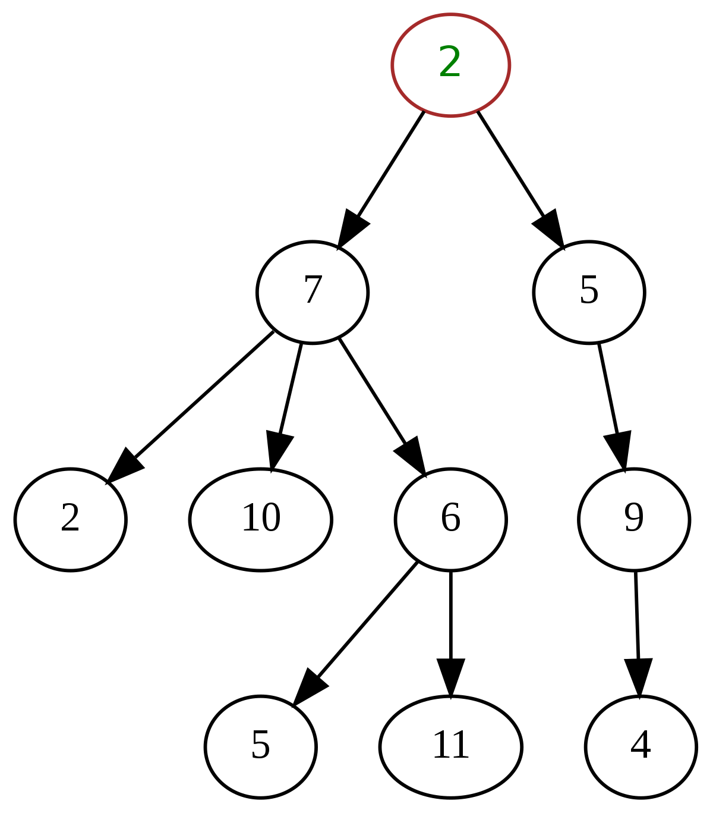

# Table of Contents

- [Introduction](#introduction)
- [Types of Trees data structures](#types-of-trees-data-structures)
- [Possible Operations](#possible-operations)
- [Advantages](#advantages)
- [Disadvantages](#disadvantages)
- [Use Cases](#use-cases)
- [Python Implementation](#python-implementation)
- [Time Complexities](#time-complexities)
## Introduction

Trees are an essential data structure for storing hierarchical data with a directed flow.

Similar to linked lists and graphs, trees are composed of nodes which hold data. Nodes also store references to zero or more other tree nodes. Data moves down from node to node. We depict those references as lines drawn between rectangles.

- `root:` A node which has no parent. One per tree.
- `parent:` A node which references other nodes.
- `child:` Nodes referenced by other nodes.
- `sibling:` Nodes which have the same parent.
- `leaf:` Nodes which have no children.
- `level:` The height or depth of the tree. Root nodes are at level 1, their children are at level 2, and so on.

<small>_Photo curtesy of: [wikipedia](https://en.wikipedia.org/wiki/Tree_(data_structure))_</small>

### Types of Trees data structures
- General Tree: a general tree has no restrictions. A parent node can has any number of child nodes
- Binary Tree: every node can has two nodes at all. One left tree and one right tree.
- Binary Search Tree: is an optimised binary tree. Are used for various sort and search methods. The tree will sort the items.
Balanced Tree / AVL Tree: is an optimised binary search tree. The left and right sub-tree only differs by one or are equal. The tree will always be balanced.

## Possible Operations
Possible operations you can perform on an tree: 
- Traversal
- Insertion
- Deletion
- Searching

## Advantages 
- Trees provide hierarchical representation for the data.
- Trees are dynamic in nature so the number of nodes are not limited.
- Insertion and deletion in a tree can be done in moderate time.

## Disadvantages
- Some trees can only be stored using sequential or chained storage.

## Use Cases
- Trees can be used to store data which are in hierarchical form.
- Different types of trees are used in various fields like in databases, computer graphics, computer networks.
- Tree data structure are used by operating system to manage file directory.

## Python Implementation

[You can see my python implementation in here](./tree.py)

## Time Complexities

#### Time Complexity of a Binary Tree

The worst case of a binary tree is `O(n)`

The reason for that is that all children can be left or right children. That would look like the following:

To search for element `n`. It has to traverse to all elements. The same is happening for inserting `n` as a child and deleting the element `n`.

#### Time Complexity of Binary Search Tree

The worst case for a binary search tree is `O(n)` for searching, deleting and inserting. It is the same reason as for the time complexity of a binary tree. 
If all children are left children, it has to iterate through all levels.

The only different is that only has to transfer through the height of the tree, because in a binary search tree, the left side is smaller then the parent and the right side is bigger then the parent. 

That means it would iterate to the right location in every iteration. 

So the worst case in general is `O(h)` where `h` is the height of the tree.

#### Time Complexity of AVL/ Height Balanced Tree

The worst case of a AVL tree is `O(log n)` for searching, deleting and inserting -  because the AVL tree is always balanced. 

It is balanced if every left and right sub-trees only differ by 1 or are equal. If that is not the case the tree will change some node positions by routing them.

The tree will be balanced after every new insert. That means we are performing a normal binary search tree insert and afterwards are go back up the ancestors and are checking the the left and right sub-tree height. 

If not balanced there will be a rotation of the nodes take place (left left case, left right case, right right case or right left case).